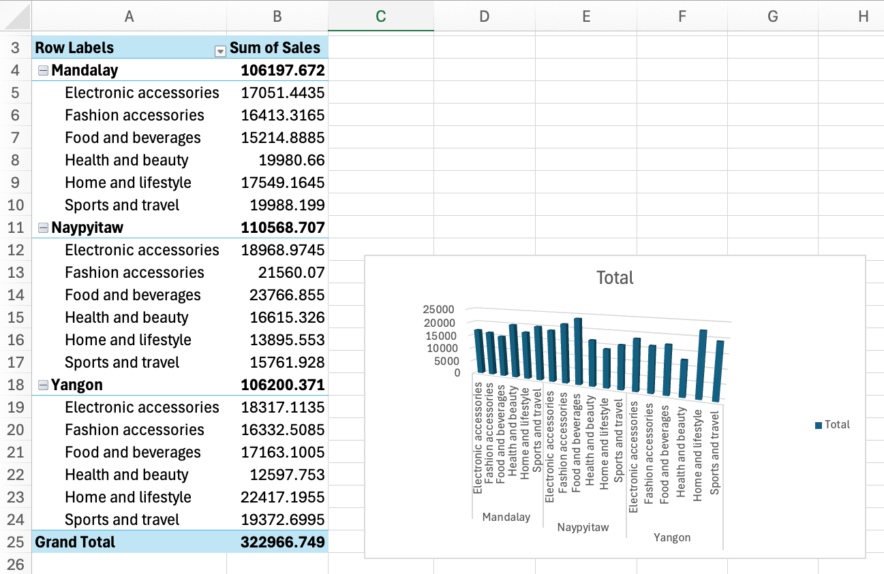

# SuperMarket Sales

## Project Overview

This project analyzes retail sales data to identify revenue trends, top-performing product categories, and customer behavior patterns. The analysis was performed using Excel for data cleaning and dashboard creation.

The objective of this project is to help retail businesses make data-driven decisions through sales analysis and visualization.
## Dataset

**Source:** [SuperMarket Sales](https://www.kaggle.com/datasets/roopacalistus/superstore)

**File in the repo:** [supermarket-analysis.xlsx](data/supermarket-analysis.xlsx)

## What I Did

- Removed duplicate records
- Checked and handled missing values
- Sales analysis by branch, category, and customer type
- Created a sales dashboard to visualize key insights

## Screenshots

## Tools & Skills

- Excel
- SQL
- TABLEAU

## Key Insights 

- Naypyitaw generated the highest total sales revenue
- Food and beverages category performed best across branches
- Member customers contributed more revenue compared to normal customers
- Monthly sales trends showed consistent business growth
